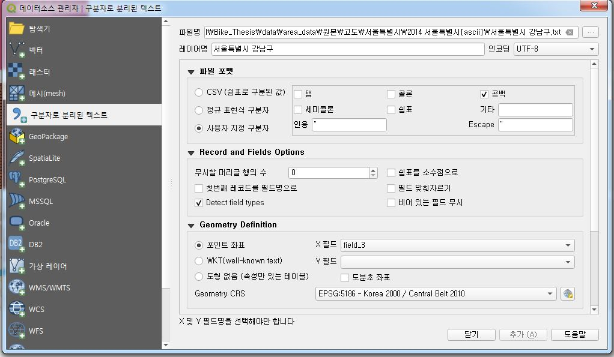

### 위도, 경도, 고도 데이터를 가진 txt 파일로 등고선 shp 파일 만들기

#### ※ qgis desktop 3.4.4 version을 기준으로 작성되었습니다.

* QGIS를 실행시킵니다.

* QGIS 메뉴에서 레이어 -> 레이어 추가 -> 구분자로 분리된 텍스트 레이어를 추가... 를 클릭합니다.

* 파일명의 '...'을 눌러서 원본 파일을 불러 옵니다.
* 파일 포맷 
  * txt 파일 등의 필드가 쉼표로 구분되어 있으면 쉼표, 공백으로 되어있으면 공백을 체크박스 표시합니다.
* Geometry Definition
  * 포인트 좌표에서 X, Y 필드(열) 이름을 각각 선택합니다. 
  * Geometry CRS : 해당 포인트의 좌표계를 선택합니다.
* 맨 아래 오른쪽의 추가 버튼을 누릅니다.

* QGIS 메뉴에서 벡터 -> Contour 버튼을 누릅니다.

* Input
  * Point layer : 방금 추가한 Layer 이름을 선택합니다.
  * Data value : layer의 고도 필드 이름을 선택합니다.
* Contouring : 저는 등고선을 5m 간격으로 일정하게 만든다는 가정을 하고 만들었습니다.
  * Method : Fixed contour interval를 선택합니다.
  * interval : 5를 넣습니다.
  * Number : 등고선의 개수를 말합니다. 최소 고도와 최대 고도를 고려하여 숫자를 써야 하는데 오른쪽의 하얀 박스에 숫자가 나올 때까지 값을 계속 올려 입력합니다. 예를 들면 0 ~ 100이라 하면 Number는 최소 21 이상이 되어야 합니다.
* Output
  * Layer name : 지정하고 싶은 이름으로 레이어 이름을 입력합니다.
* Add 버튼을 누릅니다.

* 만든 등고선의 레이어를 오른쪽 마우스 클릭하여 -> 내보내기 -> 객체를 다른 이름으로 저장... 을 누릅니다.

* 파일명 : ...을 눌러서 원하는 이름으로 저장합니다.
* 좌표계 : 원하는 좌표계를 선택합니다.
* 확인 버튼을 누릅니다.

  
#### 지금까지 QGIS로 등고선을 만들어서 shp 파일로 저장하는 방법을 알아보았습니다. 봐주셔서 감사합니다.
